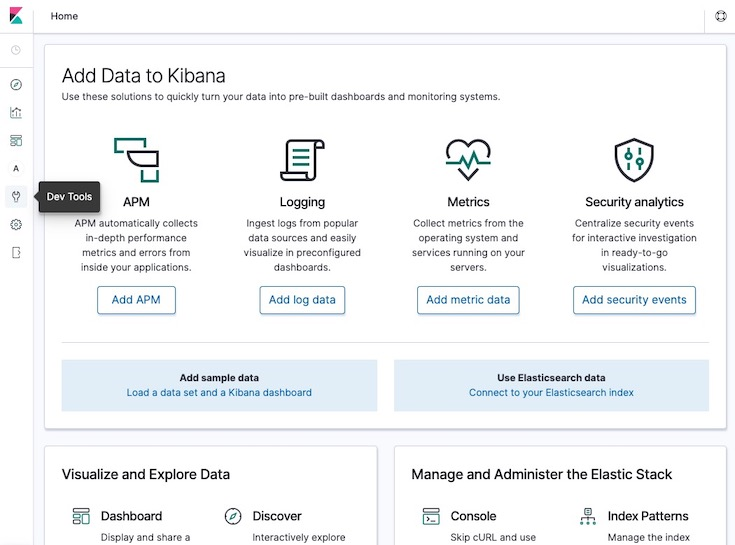

# AWS Managed Elasticsearch with Cognito RBAC

This is compact solution / template to show how you can configure AWS Elasticsearch with AWS Cognito and apply some restrictions.

1. Create a CloudFormation Stack with [elasticsearch.yaml](./elasticsearch.yaml) template (You can use the all the default settings but don't forget to tick the boxes in the bootem of the last step: `Capabilities and transforms`)
2. Create users in the AWS Cognito User Pool console and assign one of the groups (**Note:** don't assign more than one group to a user or it will get access denied)
3. Access Kibana (you can find the URL in the Outputs of the CloudFormation Stack)

## Tests

Using Kibana Dev Tools:



### Admin

Only users in the **Admin** group can create docs, if you try this with a user in another group it should fail.

```
PUT twitter/_doc/1
{
    "user" : "kimchy",
    "post_date" : "2009-11-15T14:12:12",
    "message" : "trying out Elasticsearch"
}
```

### Developers

Users in other groups can only read docs in their projects (current policy allows any index):

* **ProjectAGroup** can read from **-proj-a** cluster
* **ProjectBGroup** can read from **-proj-b** cluster

```
GET twitter/_doc/1
```

---

## Findings

Before discussing the findings, keep in mind Elasticsearch works like this:

* ES has a REST API and basic actions are CRUD (Create, Read, Update and Delete).
* ES also allows "less CRUD APIs" (at least purists would say that) and by that I mean: they allow multisearch and bulk operations where the index can be specified on the HTTP request Body instead of in the HTTP request Path.

At the time, 6th of January 2020:

* AWS ES IAM Policies only allow us, as far as I know, to block requests based on the HTTP Path. That prevents someone to read, modify or create a document using the Document "CRUD" API.
* Requests with the index in the HTTP Body bypass the IAM Policies, there is a way to disable this in the ES, although if we do that Kibana stops working because loads of operations are apparently using ES multisearch.
* Since multisearch is required for Kibana we can't disable `_msearch`.
* `_bulk` ES REST API can be used as a _"hack"_ for write requests **so we need to be carefull and whitelist or blacklist this API(s)**
    * To blacklist we can add a Deny statement for the `_bulk` requests (check IAM Policies for Project A in the CloudFormation template elastisearch.yaml)
    * We can just white list the API(s) needed (check IAM Policies for Project B in the CloudFormation template elastisearch.yaml)
    * *We can block for instance _bulk in the Cognito IAM Policy although we need to evaluate all the APIs to make sure that other "hacks" can't be used for at leasts to edit the data.*

* I'm not entirely sure about the current implementation of beats and logstash, but they were using bulk request to index the logs and metrics which means that if we disable this on ES we would probably break the log ingestion.

Also:

* AWS ES Service doesn't support cross cluster search so we can segregate data per AWS ES Domain.

To show how you can bypass the IAM Polices, _Project B_ IAM Policy has a explicit **Deny** for a index named **twitter_blocked_index**.

_Kibana for Project B_ you can try the follow:

1. Login with a user inside group **AdminGroup**
2. Using the admin user you can create a doc in index **twitter_blocked_index**:

```
PUT twitter_blocked_index/_doc/1
{
    "user" : "kimchy",
    "post_date" : "2009-11-15T14:12:12",
    "message" : "trying out Elasticsearch"
}
```

3. Login with a user inside group **ProjectAGroup**
4. Bypass read permissions with `_msearch` (no index in the HTTP path):

```
GET _msearch
{"index" : "twitter_blocked_index"}
{"query" : {"match_all" : {}}}
```